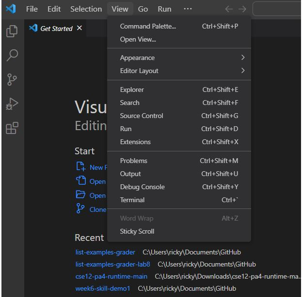
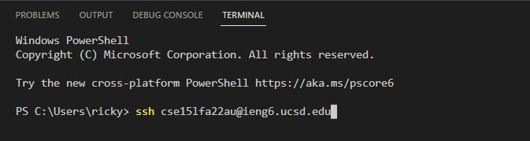
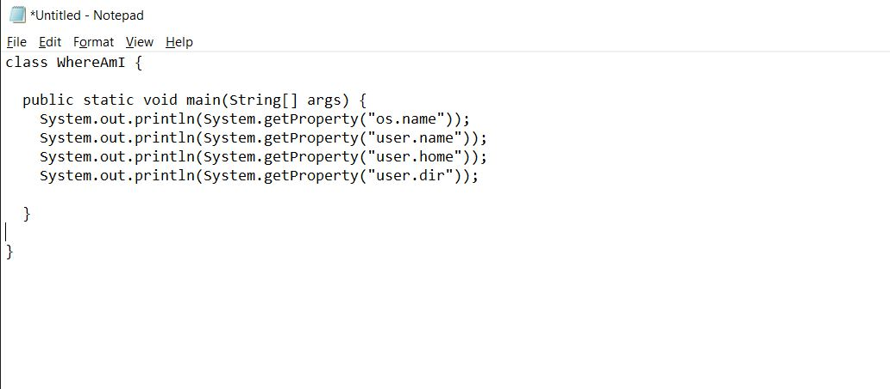

Ricky Li
Joe Politz
30 September 2022

### CSE 15L Lab Report 1

# Installing VScode

For the VSCode part, I didn’t have to do anything because I already used VSCode for cse11 last quarter but you can go to the visual studio code website and follow the instructions to download.

https://code.visualstudio.com/download 

There are different buttons you need to click depending on if you are downloading on Windows, Mac, or Linux OS.

# Remotely Connecting

For remotely connecting, I personally downloaded OpenShell onto my laptop, then I requested to change my password through the ucsd system in order to log in to my remote cse account. It wouldn’t let me connect during lab hours but once I got back home and changed my password again I went through. I logged in using the ssh command followed by the name of my account

In order to remotely connect, you will need to open up a new window on visual studio code. Then on the top right, you can hover over view and go down to where it says Terminal. Click on terminal in order to view the terminal (or you can press Ctrl + `). The terminal is where you will be typing your commands. You also need to figure out what your ieng6 account is.

Here is the website to look up your ieng6 account using your ucsd credentials.
https://sdacs.ucsd.edu/~icc/index.php

Also if you need to change your password here is a tutorial
https://docs.google.com/document/d/1hs7CyQeh-MdUfM9uv99i8tqfneos6Y8bDU0uhn1wqho/edit/

Ex. “ssh cs15lfa22zz@ieng6.ucsd.edu”
It will then prompt you for your password. 

 
Typing the password is difficult because it doesn’t show you any inputs. The server will tell you that the authenticity of the host cannot be established then ask you if you still want to connect to the host.
Looking like this
The authenticity of host 'ieng6-202.ucsd.edu (128.54.70.227)' can't be established.
RSA key fingerprint is SHA256:ksruYwhnYH+sySHnHAtLUHngrPEyZTDl/1x99wUQcec.
Are you sure you want to continue connecting (yes/no/[fingerprint])? 

After you say yes, you will then be prompted to input your password again

# Trying Some Commands

I ran
ls -lat
This command lists/shows all the recently edited files

ls -a
This command lists all the hidden files

cd ~
cd stands for change directory and the little ~ in front changes the directory to the very beginning usually where it says User then your profile

cp /home/linux/ieng6/cs15lfa22/public/hello.txt ~/
Cp as far as I know stands for class path and I assume that

cat /home/linux/ieng6/cs15lfa22/public/hello.txt ~/
This command printed out the txt file hello.txt on the remote server which outputted “Hi! Welcome to CSE15L Fall 22”

# Moving Files with scp

In order to show how to move files with scp, I created a new file called WhereAmI.java
 
I made WhereAmI.java using notepad where I typed the code out and made sure to save the file as a .java file.
 

I then opened up the file in visual studio code in order to use the scp command (scp file location) to copy the file from my local computer to the remote server on my account.

 
For the example below I typed in scp WhereAmI.java cse15lfa22au@ieng6.ucsd.edu:~/

I then compiled the WhereAmI.java file using javac WhereAmI.java and ran the program which outputed 

Linux    <----- OS

cse15lfa22au     <----- user

/home/linux/ieng6/cse15lfa22/cse15lfa22au    <----- home

/home/linux/ieng6/cse15lfa22/cse15lfa22au    <----- current directory

# Setting an SSH Key

Then using the command ssh-keygen in the lab, I created two keys. I then used the scp command to move one of the keys onto the remote server. 
scp /Users/ricky/.ssh/id_rsa.pub cs15lfa22au@ieng6.ucsd.edu:~/.ssh/authorized_keys
Now I can ssh using the key I created and instead of typing my entire password to login to the remote server every time, I can just use a simpler phrase to continually log in.

# Optimizing Remote Running

I ran the ls command on the remote computer using my key to easily list the files in the directory. I simply used my passphrase instead of my normal password.
ssh cs15lfa22au@ieng6.ucsd.edu “ls”
 I also used multiple commands at once to compile and run the WhereAmI java file more efficiently instead of changing the path for the code, compiling, then running the code all in separate lines
“cp WhereAmI.java OtherMain.java; javac OtherMain.java; java WhereAmI”

