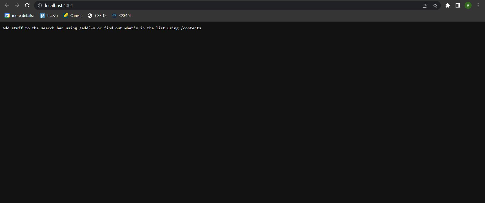
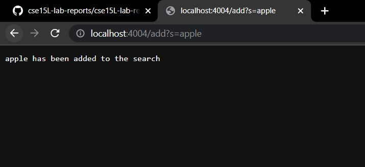
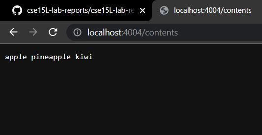
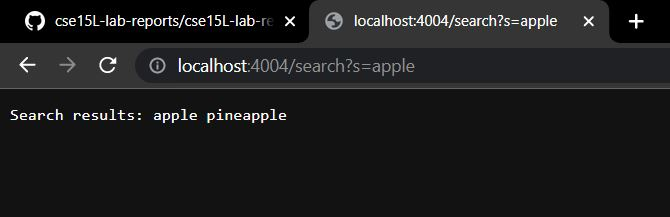
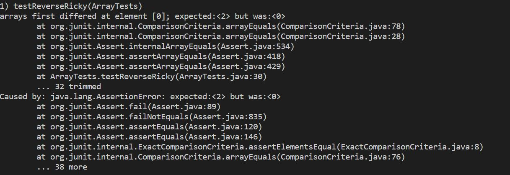
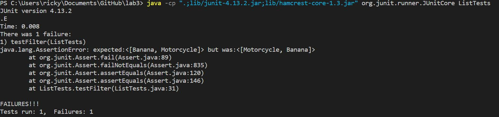

Ricky Li
Joe Politz
30 September 2022

### CSE 15L Lab Report 2

# Part 1

```

import java.io.IOException;
import java.net.URI;

class Handler implements URLHandler {
    // The one bit of state on the server: a number that will be manipulated by
    // various requests.
    String[] num = new String[300];
    int size = 0;

    public String handleRequest(URI url) {
        if (url.getPath().equals("/")) {
            return String.format("Add stuff to the search bar using /add?s= or find out what's in the list using /contents");
        } else if (url.getPath().equals("/empty")) {
            num = new String[300];
            size = 0;
            return String.format("Search bar has been emptied");
        } else if (url.getPath().equals("/contents")) {
            String list = "";
            if (size == 0) {
                return String.format(list);
            }
            for (int i=0; i < size; i++) {
                list += num[i] + " ";
            }
            return String.format(list);
        } else if (url.getPath().contains("/search")) {
            String[] parameters = url.getQuery().split("=");
                if (parameters[0].equals("s")) {
                    String list = "";
                    for (int i = 0; i < size; i++) {
                        if (num[i].contains(parameters[1])) {
                            list += num[i] + " ";
                        }
                        
                    }
                    return String.format("Search results: " + list);
                }
        } else {
            System.out.println("Path: " + url.getPath());
            if (url.getPath().contains("/add")) {
                String[] parameters = url.getQuery().split("=");
                if (parameters[0].equals("s")) {
                    num[size] = (parameters[1]);
                    size += 1;
                    return String.format(parameters[1] + " has been added to the search");
                }
            }
        }
        return "404 Not Found!";
    }
}


public class SearchEngine {
    public static void main(String[] args) throws IOException {
        if(args.length == 0){
            System.out.println("Missing port number! Try any number between 1024 to 49151");
            return;
        }

        int port = Integer.parseInt(args[0]);

        Server.start(port, new Handler());
    
    }
}

```



Running java NumberServer, you need to add any number between 1024 to 49151 (I picked 4004 example; java NumberServer 4004) which represents the port in which the local site is created on your computer. Using the URLHandler, it reads the url for this port and does various methods in order to store strings. I created this by copying the code given to us in lab 1 and tweaking some things around to match the intended methods.

When the java file first runs, the code creates an empty string Array with size 300 called num and initializes an integer named size that is set at 0. When visiting the local page, the method String handleRequest(URI url) which uses the getPath() method to grab the path of the url parameter. If the path contains "/", then the string returned will be printed on the screen which "Add stuff to the search bar using /add?s= or find out what's in the list using /contents". This is so it can remind me on how the program works.



For adding things into the list the handleRequest(URI url) is also used however when using the getPath() function, if add is found in the path instead of just "/".

When add is found in the path, the getQuery() function is used and it grabs whatever string is in the query after the "=". For the example above, the string after the "=" is "apple", so the code will grab the apple string and put it into the string array num. The code will also increment the size by 1 and return "apple has been added to the search"



The content feature also uses the handleRequest(URI url) method and is introduced if getPath() sees /contents in the path. In the example above I added two other items "pineapple" and "kiwi". 

This method creates an empty string called "list" and it runs a for loop for the amount of elements in the array num. It will then add all the strings in num followed by a space. The website will then return "list"  which is a string of all the strings that were stored in num (apple pineapple kiwi).



For my search feature if search is found in the path using the handleRequest(URI url) and getPath() methods, it will grab whatever using is in the query past the "=" using the getQuery method (for the image above it was "apple"). 

An empty string named "list" is created in order to store all the strings that matches whatever was searched. Then it will sift through all the strings in the num array using a for loop to see if they contain "apple". It will then add the string to the empty list string followed by a space. Then the website will print out "Search results:" + the list of matching strings (in this case it was apple and pineapple)

# Part 2

### ArrayExamples

In ArrayExamples, there was a bug in the reversed method

```

static int[] reversed(int[] arr) {
    int[] newArray = new int[arr.length];
    for(int i = 0; i < arr.length; i += 1) {
      arr[i] = newArray[arr.length - i - 1];
    }
    return arr;
  }
  
```

I ran a test that looked like this

```

@Test 
	public void testReverseRicky() {
    int[] input1 = { 1, 2 };
    ArrayExamples.reversed(input1);
    assertArrayEquals(new int[]{ 2, 1 }, ArrayExamples.reversed(input1));
	}
    
 ```
 
 This test created an int array and used the reverse method in order to get the array in reversed order {1, 2}  ---->  {2, 1}
 
 However when I ran the test these error messages popped up
 
 
 I then realized that the bug happened because in the Reversed method code, it creates a new int array for the reversed integers to be stored but instead of updating the new array, the code would update the old array arr from the new array which had nothing in it.
 
 ```

static int[] reversed(int[] arr) {
    int[] newArray = new int[arr.length];
    for(int i = 0; i < arr.length; i += 1) {
      newArray[i] = arr[arr.length - i - 1];
    }
    return newArray;
  }
  
```

so I swapped the variables newArray and arr around in order for the code to produce the correct output.

### ListExamples

For the ListExamples file, the filter method was not working correctly 

```

static List<String> filter(List<String> list, StringChecker sc) {
    List<String> result = new ArrayList<>();
    for(String s: list) {
      if(sc.checkString(s)) {
        result.add(0, s);
      }
    }
    return result;
  }
  
```

My test looked like this 

```

@Test 
	public void testFilter() {
    StringChecker sc = new StringChecker() {

        public boolean checkString(String s) {
            if (s.length() > 5) {
                return true;
            }

            return false;
        }

    };
    
    
    List<String> input1 = new ArrayList<String>();
    input1.add("Banana");
    input1.add("Red");
    input1.add("Motorcycle");

    List<String> output = new ArrayList<String>();
    output.add("Banana");
    output.add("Motorcycle");

    assertEquals(output, ListExamples.filter(input1, sc));
	}

```

My string checker checked if the string in the List was greater than 5 characters or not (Ex. if i were to input list {Banana, Red, Motorcycle} ----> {Banana, Motorcycle}

However it gave me this error message when I ran my tests.


It outputted {Motorcycle, Banana} instead of {Banana, Motorcycle}

I then realized that this is because in the line where it says result.add(0, s), it would send the string to the very beginning of the list which would mess up the original order of the list because the most recently added strings would move up to the front. After I removed the index 0 and simply put result.add(s), it fixed the code and outputted what it was intended to output


```

static List<String> filter(List<String> list, StringChecker sc) {
    List<String> result = new ArrayList<>();
    for(String s: list) {
      if(sc.checkString(s)) {
        result.add(0, s);
      }
    }
    return result;
  }
  
```
