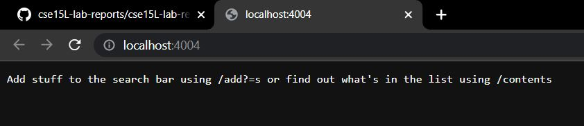

Ricky Li
Joe Politz
30 September 2022

### CSE 15L Lab Report 2

# Part 1

```

import java.io.IOException;
import java.net.URI;

class Handler implements URLHandler {
    // The one bit of state on the server: a number that will be manipulated by
    // various requests.
    String[] num = new String[300];
    int size = 0;

    public String handleRequest(URI url) {
        if (url.getPath().equals("/")) {
            return String.format("Add stuff to the search bar using /add?s= or find out what's in the list using /contents");
        } else if (url.getPath().equals("/empty")) {
            num = new String[300];
            size = 0;
            return String.format("Search bar has been emptied");
        } else if (url.getPath().equals("/contents")) {
            String list = "";
            if (size == 0) {
                return String.format(list);
            }
            for (int i=0; i < size; i++) {
                list += num[i] + " ";
            }
            return String.format(list);
        } else if (url.getPath().contains("/search")) {
            String[] parameters = url.getQuery().split("=");
                if (parameters[0].equals("s")) {
                    String list = "";
                    for (int i = 0; i < size; i++) {
                        if (num[i].contains(parameters[1])) {
                            list += num[i] + " ";
                        }
                        
                    }
                    return String.format("Search results: " + list);
                }
        } else {
            System.out.println("Path: " + url.getPath());
            if (url.getPath().contains("/add")) {
                String[] parameters = url.getQuery().split("=");
                if (parameters[0].equals("s")) {
                    num[size] = (parameters[1]);
                    size += 1;
                    return String.format(parameters[1] + " has been added to the search");
                }
            }
        }
        return "404 Not Found!";
    }
}


public class SearchEngine {
    public static void main(String[] args) throws IOException {
        if(args.length == 0){
            System.out.println("Missing port number! Try any number between 1024 to 49151");
            return;
        }

        int port = Integer.parseInt(args[0]);

        Server.start(port, new Handler());
    
    }
}

```


Running java NumberServer, you need to add any number between 1024 to 49151 (I picked 4004 example; java NumberServer 4004) which represents the port in which the local site is created on your computer. Using the URLHandler, it reads the url for this port and does various methods in order to store strings. I created this by copying the code given to us in lab 1 and tweaking some things around to match the intended methods. As you can see I added the prompt "Add stuff to the search bar using /add?s= or find out what's in the list using /contents" so it can remind me on how the program works.


For my add method, if add is found in the path, then it will take whatever in the query (in this case apple) and adds the string "apple" in to a string array called num which was initialized in the very beginning of the code. It also increments the the int size by one which represents how many elements are in the num array. 


