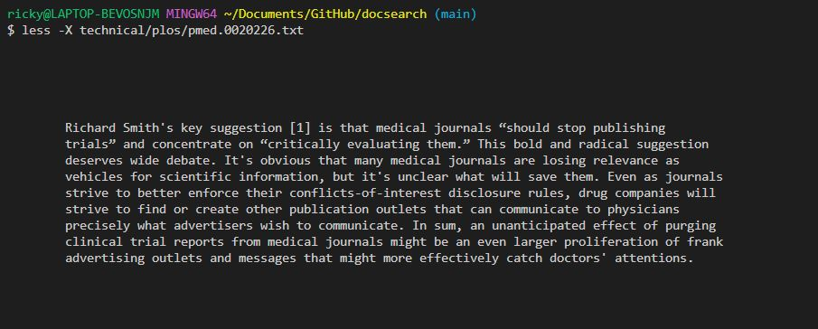
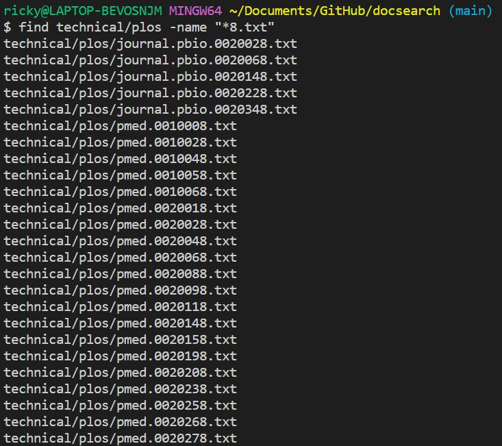
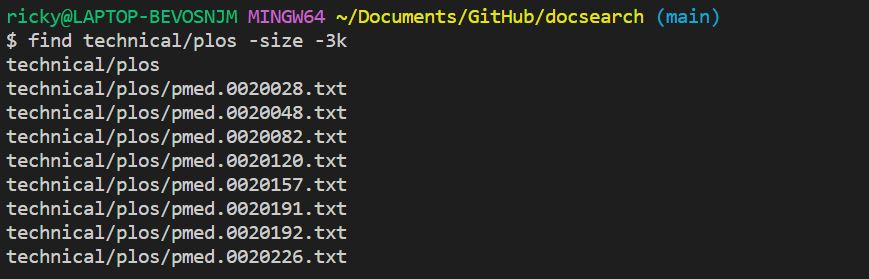
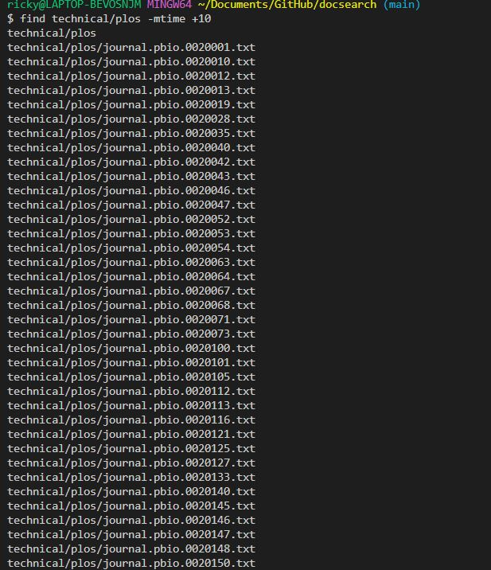
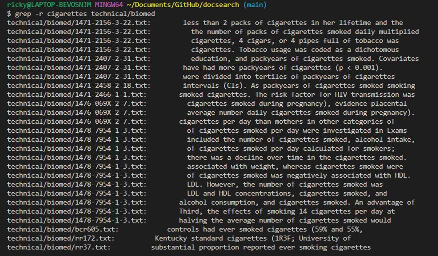
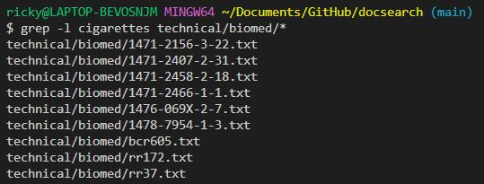
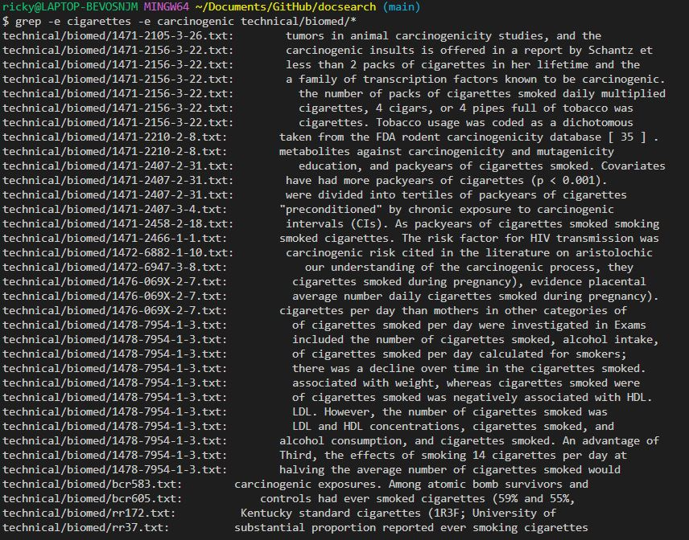

Ricky Li
Joe Politz
31 October 2022

### CSE 15L Lab Report 3

# Less

The less command allows you to look at the contents of a file. You can scroll through the file using the arrow keys and exit the less command by pressing -q

## -N
```

1
      2
      3
      4
      5
      6         People living with HIV/AIDS (PLWA) face many forms of stigma and discrimination. This is
      7         the case in whichever country they may live, as has been shown in a number of previous
      8         research studies. In addition to experiencing unfair treatment in their families,
      9         communities, and places of work, PLWA may encounter discrimination from health-care
     10         professionals. This can interfere with effective prevention and treatment. Discriminatory
     11         practices in the health-care sector may also appear to legitimize other forms of
     12         discrimination against PLWA.
     13         Vincent Iacopino and colleagues from the organization Physicians for Human Rights, in
     14         collaboration with researchers from Policy Project–Nigeria and the Center for the Right to
     15         Health (also in Nigeria) investigated the problem in Nigeria. With a population of roughly
     16         130 million, Nigeria is home to one in 11 of the 40 million PLWA worldwide. Around 6% of
     17         adult Nigerians are thought to be HIV-positive, and there will be an estimated 310,000 AIDS
     18         deaths this year. The indications are that infection rates will increase. Until now, little
     19         has been known about the nature and extent of discrimination against patients with HIV/AIDS
     20         in Nigeria.
     21         Trained interviewers conducted a cross-sectional questionnaire survey of 1,021 Nigerian
     22         health-care professionals in 111 health-care facilities in four of Nigeria's 36 states.
     23         Those sampled were 324 physicians, 541 nurses, and 133 midwives, and 23 health-care workers
     24         of unknown profession. Fifty-four percent of them worked in public tertiary care
     25         facilities. Many of the survey's results are worrying. Nine percent of professionals
     26         reported refusing to care for a patient with HIV/AIDS, and 9% said they had refused a
     27         patient with HIV/AIDS admission to a hospital. Fifty-nine percent agreed that PLWA should
     28         be on a separate ward, and 40% believed a person's HIV status could be determined by their
     29         appearance. Ninety-one percent agreed that staff should be informed when a patient was
     30         HIV-positive in order to protect themselves. Forty percent believed health-care
technical/plos/pmed.0020257.txt

```
less -N technical/plos/pmed.002057.txt

The -N option gives you the option to have line numbers on the left side of the file so that you have an easier time looking through the file. I used the -N file on the pmed.0020209.txt file and I saw that it contained 299 lines.

## -p

```

company. The scientist had read my articles on whistleblowers who had raised concerns about
        the undue influence of the pharmaceutical industry on American medicine My industry source
        had information for me about drug company practices, but—out of fear of career ruin—would
        only talk on the condition that I would conceal the scientist's identity.
        For the next year or so, I had repeated contacts with the scientist. As I listened to
        this researcher—and to the other medical whistleblowers that I continued to interview—it
        occurred to me that each whistleblower was like the proverbial blind man with a hand on the
        elephant. Each could describe one piece of the puzzle, but the full picture could only
        emerge by bringing these whistleblowers together.
        With an eye to focusing on the systemic problems that have allowed American medicine to
        be unduly influenced by industry, on May 15, 2005, I brought together five whistleblowers
        in Washington, D. C. I asked them each to tell their story and to suggest ways to restore
        objectivity to medicine and medical research.


        The **Whistleblowers**
        Four **whistleblowers** attended in person, and the anonymous industry scientist
        participated via speakerphone. The whistleblowers came from an extraordinary variety of
        different professional backgrounds.


            David Graham
            This Food and Drug Administration (FDA) safety officer raised concerns about the
            cardiovascular side effects of rofecoxib (Vioxx) and other Cox-2 inhibitors. He
            testified at a United States Senate Finance Committee hearing on rofexocib, the FDA,
            and Merck [1,2]. Graham attended the roundtable in his own personal capacity and was
            not representing the FDA.

              Each whistleblower was like the proverbial blind man with a hand on the
technical/plos/pmed.0020209.txt

```

less -pwhistleblower technical/plos/pmed.0020209.txt

The -p option highlights what you are looking for while you are using less. For the example above I typed less -pwhistleblower technical/plos/pmed.0020209.txt 

This highlighted all the "whistleblower" words in the file making them easier for me to see

## -X



less -X technical/plos/pmed.0020226.txt

The -X option makes the contents of the file stay on the screen even after you leave less. Usually when you ar in less and you press q, the contents of the file go away when the less command ends, but if you use the -X option, the contents will stay as shown above.

# Find

The find command allows you to search through files and directories

## -name

find technical/plos -name ".txt"



The -name option allows you to search for a file with that name. This is especially useful for when you are searching for a specific extension (.txt, .java) In the example above, I used the find -name option to find all the files in the plos directory ending with 8.txt.

## -size

find technical/plos -size -3k



The -size option allows you to search for a file based on size. You can use the +size option to find a file that is bigger than the argument or -size to find a file smaller. For the example above, I used -size -3k to find files smaller than 3 kilobytes 

## -mtime



find technical/plos -mtime +10

The -mtime option allows you to search for a file based on the time the file was last edited or modified. You can use + or - to signal whether you want to look for files updated after or before the past days. In the example above I used -mtime +10 which looked for files that have been updated more than 10 days ago.


# Grep

The grep command searches for a matching string in a file

## -r



grep -r cigarettes technical/biomed

The -r option allows you to grep an entire directory instead of just one file. For the example above, I looked through the entire biomed directory for files containing the word "cigarettes"

## -l 



grep -l cigarettes techincal/biomed/*

The -l option will grep for the given files but will only return the file names instead of the file name and the lines containing the string. For the example above, I grepped through all the files in the biomed directory containing "cigarettes". This way is a lot easier to read compared to the previous example.

## -e 



grep -e cigarettes -e carcinogenic technical/biomed/*

The -e option allows you to grep for multiple strings at once. For the example above, I grepped the biomed directory for files containing cigarettes or carcinogenic.
