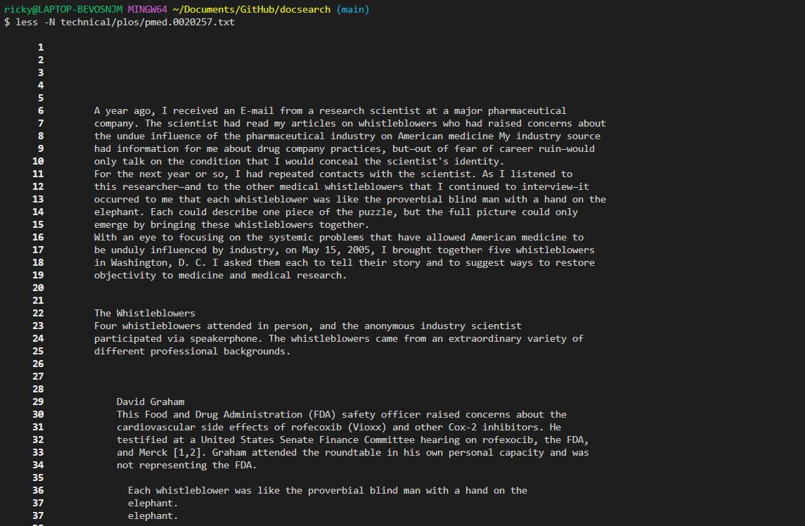
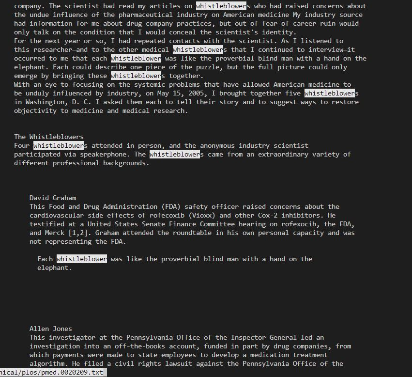

Ricky Li
Joe Politz
31 October 2022

### CSE 15L Lab Report 3

# Less

The less command allows you to look at the contents of a file. You can scroll through the file using the arrow keys and exit the less command by pressing -q

## -N

The -N option gives you the option to have line numbers on the left side of the file so that you have an easier time looking through the file. I used the -N file on the pmed.0020209.txt file and I saw that it contained 299 lines.

## -p

The -p option highlights what you are looking for while you are using less. For the example above I typed less -pwhistleblower technical/plos/pmed.0020209.txt 

This highlighted all the "whistleblower" words in the file making them easier for me to see

## -X

The -X option makes the contents of the file stay on the screen even after you leave less. Usually when you ar in less and you press q, the contents of the file go away when the less command ends, but if you use the -X option, the contents will stay as shown above.

# Find

The find command allows you to search through files and directories

## -name

The -name option allows you to search for a file with that name. This is especially useful for when you are searching for a specific extension (.txt, .java) In the example above, I used the find -name option to find all the files in the plos directory ending with 8.txt.

## -size

The -size option allows you to search for a file based on size. You can use the +size option to find a file that is bigger than the argument or -size to find a file smaller. For the example above, I used -size -3k to find files smaller than 3 kilobytes 

## -mtime

The -mtime option allows you to search for a file based on the time the file was last edited or modified. You can use + or - to signal whether you want to look for files updated after or before the past days. In the example above I used -mtime +10 which looked for files that have been updated more than 10 days ago.

# Grep
