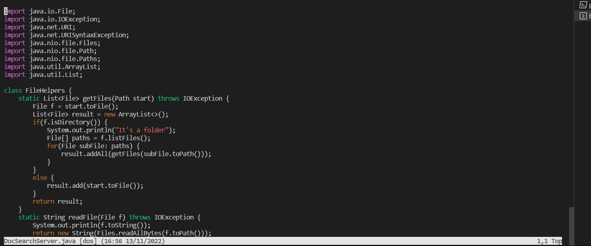
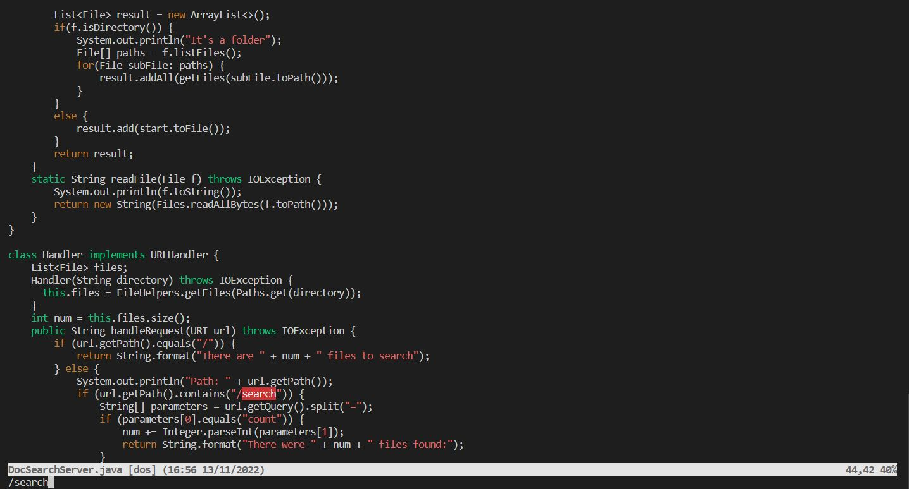
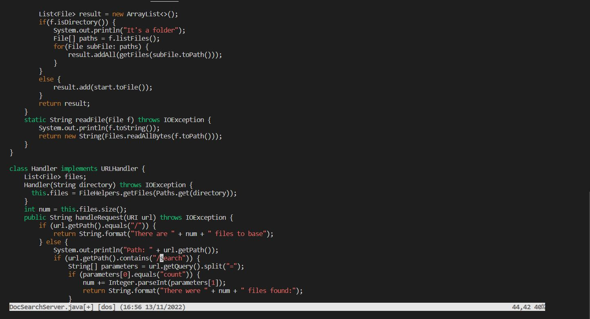
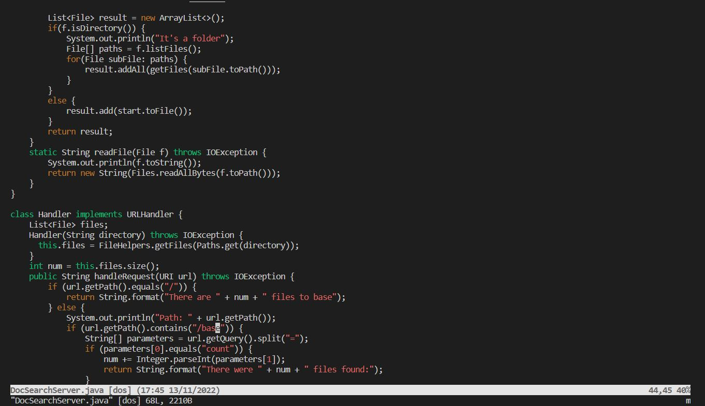

Ricky Li
Joe Politz
14 November 2022

### CSE 15L Lab Report 2

# Part 1

In DocSearchServer.java, change the name of the start parameter of getFiles, and all of its uses, to instead be called base

DocSearchServer.java:

```

import java.io.File;
import java.io.IOException;
import java.net.URI;
import java.net.URISyntaxException;
import java.nio.file.Files;
import java.nio.file.Path;
import java.nio.file.Paths;
import java.util.ArrayList;
import java.util.List;

class FileHelpers {
    static List<File> getFiles(Path start) throws IOException {
        File f = start.toFile();
        List<File> result = new ArrayList<>();
        if(f.isDirectory()) {
            System.out.println("It's a folder");
            File[] paths = f.listFiles();
            for(File subFile: paths) {
                result.addAll(getFiles(subFile.toPath()));
            }
        }
        else {
            result.add(start.toFile());
        }
        return result;
    }
    static String readFile(File f) throws IOException {
        System.out.println(f.toString());
        return new String(Files.readAllBytes(f.toPath()));
    }
}

class Handler implements URLHandler {
    List<File> files;
    Handler(String directory) throws IOException {
      this.files = FileHelpers.getFiles(Paths.get(directory));
    }
    int num = this.files.size();
    public String handleRequest(URI url) throws IOException {
        if (url.getPath().equals("/")) {
            return String.format("There are " + num + " files to search");
        } else {
            System.out.println("Path: " + url.getPath());
            if (url.getPath().contains("/search")) {
                String[] parameters = url.getQuery().split("=");
                if (parameters[0].equals("count")) {
                    num += Integer.parseInt(parameters[1]);
                    return String.format("There were " + num + " files found:");
                }
            }
        return "Don't know how to handle that path!";
        }
    }
}

class DocSearchServer {
    public static void main(String[] args) throws IOException {
        if(args.length == 0){
            System.out.println("Missing port number! Try any number between 1024 to 49151");
            return;
        }

        int port = Integer.parseInt(args[0]);

        Server.start(port, new Handler("./technical/"));
    }
}

```

Our sequence of vim commands looked like this:

`/` `s` `t` `a` `r` `t` `<Enter>` `d` `w` `i` `base` `<Esc>` `n` `d` `w` `i` `base` `<Esc>` `:` `w`
  

  

  

  

  
  
