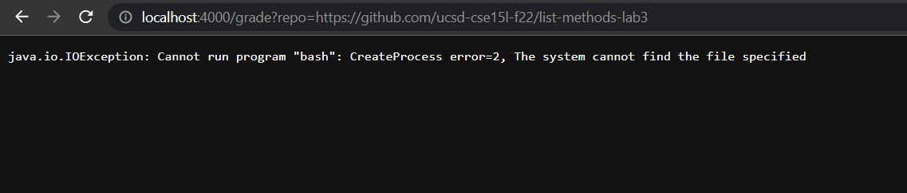
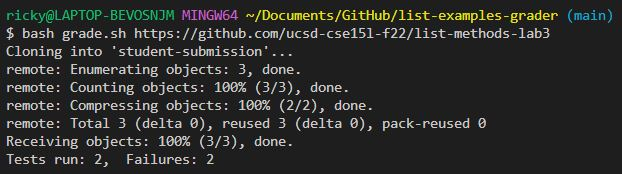
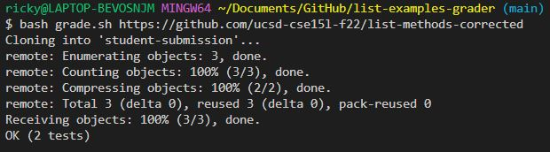
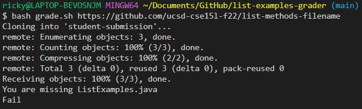

Ricky Li
Joe Politz
27 November 2022

### CSE 15L Lab Report 5

```

set -e

rm -rf student-submission
git clone $1 student-submission

cd student-submission

if [[ ! -f ListExamples.java ]]
then
  echo "You are missing ListExamples.java"
  echo "Fail"
  exit

fi


cp ../TestListExamples.java .


javac -cp ".;../lib/hamcrest-core-1.3.jar;../lib/junit-4.13.2.jar" *.java
java -cp ".;../lib/junit-4.13.2.jar;../lib/hamcrest-core-1.3.jar" org.junit.runner.JUnitCore TestListExamples

```

When I tried to run the GradeServer file on my computer and go to the url, it would give me this error message saying that it could not find bash



But it ran on VS Code


https://github.com/ucsd-cse15l-f22/list-methods-lab3





https://github.com/ucsd-cse15l-f22/list-methods-corrected





https://github.com/ucsd-cse15l-f22/list-methods-filename





For https://github.com/ucsd-cse15l-f22/list-methods-filename, the code is implemented well however the file is saved with the wrong name

```

rm -rf student-submission

```
